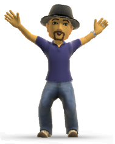

My name is Joris de Gruyter, and I'm a Belgian living and working in the United States of America. Programming and technology has been
a passion of mine from an early age, and I am one of those fortunate people who has turned their passion into a day job. 
Microsoft Dynamics AX and related technologies is my work life. I accidentally stumbled into the "Axapta" world back in 2002 (AX 2.5), around the time
Microsoft bought the product. Since then, I have worked for several ISVs and VARs on AX implementations in Belgium, The Netherlands, England,
Luxemburg, Italy and across the USA. In 2006 I moved to the USA where I initially worked for a large
accounting and technology firm managing a team of Dynamics AX developers working on customer projects. Currently I work as a senior software development engineer.
at Microsoft's Dynamics 365 for Finance&Operations (AX) division. I work on the developer productivity team, which owns the developer tools used to customize and build add-ons for Dynamicds 365 for F&O (AX). I'm very passionate about the developer ALM space for our product. 
Due to my work, any Microsoft technologies that come across my desk grab my attention and will get some one-on-one time at some point. It's difficult to stay
current on technology these days, but one tries. 
In the good ol' days of college, and even early in my professional carreer, when free time existed and hobbies reigned, web development using
PHP and MySQL, and OpenGL development in C++ on Linux platforms were what kept me up at night. Some day I will have time for that again. Sure.
For now, one of my favorite hobbies is game development. I used to create my own engines in C++ and OpenGL, these days (with less free time to spend)
I opt for Unity 3D as an easy way to get things started. 
 
I am also a former Microsoft Certified Trainer in Microsoft Dynamics AX Development. In July 2012, 2013 and 2014 I received
the Microsoft MVP (Most Valuable Professional) Award for my Dynamics AX community contributions. 
 
